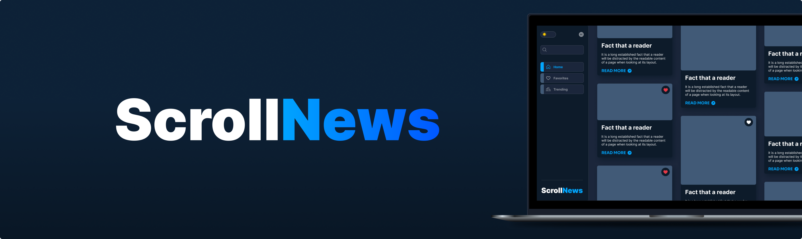

<div align="center">

  <div>
    
    
    
    
    
    
  </div>

<hr />

</div>

## 📋 <a name="table">Table of Contents</a>

1. 📜 [About the project](#about)
2. 🤖 [Introduction](#introduction)
3. ⚙️ [Tech Stack](#tech-stack)
4. 🔋 [Features](#features)
5. 🤸 [Quick Start](#quick-start)
6. 🤝 [Contributing](#contributing)

## 📜 <a name="about"> About the Project </a>

ScrollNews is a news aggregation application built in React.js that fetches daily news updates from the API, stores them in database, and saves them in localStorage before displaying them on the screen. The application is designed to provide users with the latest news updates of api in a user-friendly and interactive manner.

## <a name="tech-stack">⚙️ Tech Stack</a>

- React.js
- React Router
- Axios
- Appwrite
- Tailwind CSS

## <a name="features">🔋 Features</a>

- [x] **News Search**: News is fetched daily from the API.
- [x] **Search News**: Easily search for specific movies using a search function.
- [x] **Infinite Scroll**: News scrolls continuously on the home page.
- [x] **Favorites**: Users can save news as favorites, which are stored in localStorage.
- [x] **Trending News Algorithm**: Displays trending news based on a dynamic algorithm.
- [x] **Details Modal**: When clicking on a news item, a modal displays more information about it.
- [x] **Modern UI/UX**: A sleek and user-friendly interface designed for a great experience.
- [x] **Responsiveness**: Fully responsive design that works seamlessly across devices.

### Soon

- [ ] **Dark/Light Mode**: Switch between light and dark modes for a better user experience.

## <a name="quick-start">🤸 Quick Start</a>

Follow these steps to set up the project locally on your machine.

**Prerequisites**

Make sure you have the following installed on your machine:

- [Git](https://git-scm.com/)
- [Node.js](https://nodejs.org/en)
- [npm](https://www.npmjs.com/) (Node Package Manager)

**Cloning the Repository**

```bash
git clone https://github.com/eobrunodias/scrollnews.git
cd scrollnews
```

**Installation**

Install the project dependencies using npm:

```bash
npm install
```

**Set Up Environment SERVER Variables**

Create a new file named `.env` inside the `/server` folder of your project and add the following content:

```env.local
API_BASE_URL=
API_KEY=
```

Replace the placeholder values with your actual **[GNews API](https://gnews.io/)**. You can obtain these credentials by signing up on the [GNews](https://gnews.io/).

**Running the Server**

```bash
npm run server
```

**Set Up Environment VITE Variables**

Create a new file named `.env.local` in the root of your project and add the following content:

```env.local
VITE_APPWRITE_PROJECT_ID=
VITE_APPWRITE_DATABASE_ID=

VITE_APPWRITE_CONFIG_COLLECTION_ID=
VITE_APPWRITE_ARTICLES_COLLECTION_ID=
VITE_APPWRITE_TRENDING_COLLECTION_ID=

VITE_NEWS_UPDATE_CONFIG_ID=
```

Replace the placeholder values with your actual **[Appwrite](https://appwrite.io/)**. You can creating a new project on the [Appwrite](https://appwrite.io/)

**Running the Project**

```bash
npm run dev
```

open [http://localhost:5173](http://localhost:5173) in your browser to view the project.

## <a name="contributing">🤝 Contributing</a>

_Where can I improve?_

We welcome contributions! Whether it's improvements, bug fixes, or new features, feel free to contribute:

1. Fork the repository.
2. Create a new branch (`git checkout -b feature/new-feature`).
3. Make your changes and commit them (`git commit -am 'Add new feature'`).
4. Push your changes (`git push origin feature/new-feature`).
5. Open a Pull Request on GitHub.

---


